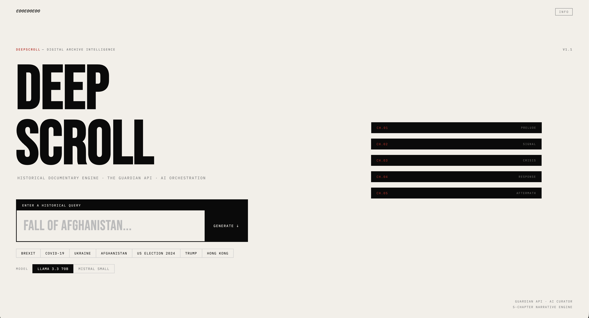

# DEEPSCROLL



**Historical Documentary Engine**
The Guardian API · AI Orchestration · Scrollytelling

**[→ Live Demo](https://deepscroll.edoedoedo.it/)**

---

### The premise is simple.

You type a historical query. The AI doesn't write about it — it *excavates* it. It designs a 5-act narrative arc, searches The Guardian's archive of over two million articles, scores and ranks the results, and renders them into an interactive scrollytelling documentary.

Every headline is real. Every excerpt is real. Every source is attributed. The AI is the director. The Guardian is the author.

---

### How it works

```
User query
    │
    ▼
LLM Orchestration (Groq / Mistral)
    │ → 5-chapter dramatic arc
    │ → Search parameters per chapter
    ▼
The Guardian Content API × 5 parallel
    │ → 20 articles per chapter
    │ → Section fallback if needed
    ▼
Scorer Algorithm
    │ → Relevance 40%
    │ → Media assets 30%
    │ → Narrative density 20%
    │ → Tone & authority 10%
    ▼
Hero enrichment (single-article fetch for body text)
    ▼
5-chapter scrollytelling documentary
```

The pipeline runs end-to-end in the browser. The LLM generates a narrative structure — not content. It decides *which moments matter*, assigns search keywords, date ranges, and Guardian sections to each chapter, then steps back. The Scorer picks the best article for each act. The rendering does the rest.

---

### The 5-act structure

Every documentary follows a fixed dramatic arc:

| Act | Tag | Role |
|-----|-----|------|
| 01 | **Prelude** | The world before. Systemic blindness, false normalcy. |
| 02 | **Signal** | The first crack nobody wanted to see. |
| 03 | **Crisis** | The breaking point. Maximum impact. |
| 04 | **Response** | How the system reacts. Bailouts, decisions, mobilization. |
| 05 | **Aftermath** | The bill comes due. What changed, what didn't. |

This is not a timeline. It's a dramaturgy. The difference matters: "2007, 2008, 2009" tells you dates. "Blindness → Signal → Collapse → Rescue → Reckoning" tells you a story.

---

### Design philosophy

**Brutalist, not decorative.** The interface exposes its own machinery — scorer breakdowns, word counts, section tags, article IDs. Metadata is not hidden; it's an aesthetic choice.

**AI as curator, not author.** The intelligence layer organizes real journalism into narrative structure. It never fabricates. Every fact comes from The Guardian's archive with explicit source attribution.

**Scroll as excavation.** The scroll is not navigation — it's the act of digging through collective digital memory. The depth bar tracks your progress. The noise marquees are the discarded articles scrolling past. The interludes force you to pause.

---

### Stack

| Layer | Technology |
|-------|-----------|
| Framework | Next.js 15 · TypeScript strict |
| AI | Vercel AI SDK v4 · Groq (Llama 3.3 70B) · Mistral |
| Data | The Guardian Content API |
| Animations | GSAP · ScrollTrigger |
| Styling | Vanilla CSS · Brutalist design system |
| Fonts | Bebas Neue · Barlow Condensed · IBM Plex Mono · DM Serif Display |
| Deploy | Vercel |

---

### Setup

```bash
git clone https://github.com/EdoEdoEdo/DeepScroll.git
cd deepscroll
npm install
```

Create `.env.local`:

```env
# At least one LLM required
GROQ_API_KEY=           # https://console.groq.com/keys
MISTRAL_API_KEY=        # https://console.mistral.ai/api-keys (optional)

# Required
GUARDIAN_API_KEY=        # https://open-platform.theguardian.com/access/
```

```bash
npm run dev
```

Visit `http://localhost:3000/api/health` to verify your keys, then `http://localhost:3000` to start.

---

### Adding a new LLM provider

1. Install the SDK: `npm install @ai-sdk/your-provider`
2. Open `app/utils/models.ts`
3. Add an entry to `MODEL_OPTIONS`:

```typescript
{
  id: "your-provider-model",
  label: "Model Name",
  provider: "your-provider",
  modelId: "model-id-string",
}
```

4. Add a `case` in `getModel()` and `getAvailableModels()` for the new provider
5. Add `YOUR_PROVIDER_API_KEY=` to `.env.local`

The model switch appears automatically in the UI when multiple keys are configured.

---

### Routes

| Route | Purpose |
|-------|---------|
| `/` | Full documentary experience |
| `/dev` | Diagnostic — test Guardian API, Scorer, and LLM independently |
| `/api/health` | Health check — verifies API keys and connectivity |
| `/api/models` | Available models based on configured keys |
| `/api/guardian?q=...` | Guardian proxy with scoring |
| `/api/guardian/article?id=...` | Single article fetch for overlay |
| `/api/orchestrate` | POST `{ query, model }` → 5-chapter arc plan |

---

### Project structure

```
app/
├── api/
│   ├── guardian/
│   │   ├── route.ts              # Search proxy, scoring, section fallback
│   │   └── article/route.ts      # Single article body fetch
│   ├── orchestrate/route.ts      # LLM → 5-chapter arc plan
│   ├── models/route.ts           # Available models endpoint
│   └── health/route.ts           # API key verification
├── components/
│   ├── QueryScreen.tsx           # Landing — input, presets, model switch, info
│   ├── LoadingScreen.tsx         # Terminal-style AI orchestration log
│   ├── DocHeader.tsx             # Documentary header with metadata
│   ├── Chapter.tsx               # Full chapter — GSAP scroll animations
│   ├── GuardianBox.tsx           # Source attribution with read-more
│   ├── AIBlock.tsx               # Corpus analysis with typing effect
│   ├── Interlude.tsx             # Dynamic red interlude cards
│   ├── DepthIndicator.tsx        # Scroll bar + chapter indicator
│   ├── Finale.tsx                # End panel with statistics
│   ├── ArticleOverlay.tsx        # Full article reading modal
│   └── InfoModal.tsx             # Project info overlay
├── utils/
│   ├── types.ts                  # All TypeScript interfaces
│   ├── scorer.ts                 # Article ranking (R40/M30/N20/T10)
│   ├── guardian-client.ts        # Server-side Guardian fetch
│   ├── arc.ts                    # Narrative constants + LLM system prompt
│   ├── pipeline.ts               # Client-side orchestration
│   ├── models.ts                 # Multi-model provider registry
│   ├── text.ts                   # HTML stripping, image extraction
│   └── gsap.ts                   # GSAP + ScrollTrigger registration
├── dev/page.tsx                  # Diagnostic testing page
├── globals.css                   # Brutalist design system
├── layout.tsx                    # Root layout
└── page.tsx                      # Main state machine
```

---

### Animations

All scroll animations use GSAP + ScrollTrigger:

- **Headlines** — clip-path reveal from bottom
- **Images** — parallax ±40px on scroll
- **Guardian Box** — slide in from left
- **Metadata rows** — stagger at 60ms intervals
- **AI Block** — word-by-word typing effect
- **Interludes** — scale entrance from 0.97
- **DocHeader** — sequenced timeline
- **Finale stats** — staggered cell reveal

---

### What DeepScroll is not

- Not a news aggregator
- Not a chatbot
- Not a search engine
- Not a content generator — every word of journalism comes from The Guardian
- Not a timeline — it's a dramaturgy

---

**Built by [edoedoedo.it](https://edoedoedo.it)**
